# Static Code Analysis to Flowchart Rendering

## 🎯 Task Objective

Perform comprehensive static code analysis on complex code systems, create detailed flowcharts for each critical node, and render them into visualized diagrams.

## 📋 Complete Workflow

### Phase 1: Static Code Analysis

```
Please conduct comprehensive static code analysis on the following code system:

**Analysis Target**: [Target code file path or class name]

**Analysis Dimensions**:
1. **Method Call Chain Analysis**: 
   - Start from main entry methods and trace all method call sequences
   - Identify dependency relationships and call hierarchies between functions
   - Annotate input/output and side effects for each method

2. **Component Interaction Analysis**:
   - Identify interaction patterns between different classes and modules
   - Analyze how data flows between components
   - Identify key design patterns and architectural patterns

3. **Data Flow Analysis**:
   - Trace complete data paths from input to output
   - Identify key nodes for data transformation
   - Analyze data storage and persistence points

4. **Control Flow Analysis**:
   - Identify conditional branches and loop structures
   - Analyze exception handling and error recovery mechanisms
   - Annotate key decision points and execution paths

5. **Dependency Mapping**:
   - External library and module dependencies
   - Configuration file and environment variable dependencies
   - Data file and resource dependencies

**Output Requirements**:
- Provide detailed Call Graph
- Component Interaction Diagram
- Data Flow Diagram
- Purpose and responsibility description for each key function
- Identify performance bottlenecks and optimization opportunities
```

### Phase 2: Node Function Annotation

```
Based on static analysis results, add detailed functional annotations for each critical node:

**Annotation Content**:
1. **Node Purpose**: 
   - The role of this node in the entire system
   - Specific problems solved or functionality implemented

2. **Input/Output**:
   - Types and meanings of input parameters
   - Format and content of return values
   - Possible side effects and state changes

3. **Core Algorithms**:
   - Main algorithms or computational logic used
   - Key mathematical formulas or business rules
   - Performance complexity analysis

4. **Code Snippets**:
   - Simplified version of core code
   - Key parameters and configuration items
   - Important conditional judgments and loop logic

5. **Dependencies**:
   - Other nodes directly depended upon
   - Which nodes call this one
   - Shared data structures or states

**Annotation Format**:
```
Node Name: [Function name or class name]
🎯 Purpose: [Concise description of node functionality]
📥 Input: [Input parameter description]
📤 Output: [Output result description]
⚙️ Algorithm: [Core algorithm or logic]
🔗 Dependencies: [Other dependent nodes]
💻 Code: [Key code snippets]
```
```

### Phase 3: Flowchart Design

```
Based on code analysis and node annotations, design multi-level flowcharts:

**Flowchart Types**:
1. **Main Execution Flowchart**: Shows the main execution paths of the system
2. **Subsystem Flowcharts**: Detailed internal processes of each subsystem
3. **Data Flow Diagrams**: Shows data flow throughout the system
4. **Component Interaction Diagrams**: Shows interactions between different components
5. **Error Handling Flowcharts**: Shows exception handling and recovery processes

**Design Principles**:
- **Hierarchical**: Multi-level presentation from overview to details
- **Color Coding**: Use different colors to distinguish different types of nodes
- **Information Density**: Balance between clarity and information content
- **Consistency**: Maintain consistency in naming and styling

**Mermaid Syntax Design**:

```mermaid
flowchart TD
    A["Node Name<br/>🎯 Functional Description<br/>📝 Technical Details"] --> B["Next Node<br/>📊 Processing Description"]
    
    style A fill:#color_code,stroke:#border_color,stroke-width:width
    style B fill:#color_code,stroke:#border_color,stroke-width:width
```


**Color Coding Scheme**:
- 🔴 Entry Nodes: #ff6b6b (Red)
- 🟢 Core Processing: #4ecdc4 (Teal)  
- 🔵 Data Processing: #0984e3 (Blue)
- 🟡 Result Output: #fdcb6e (Yellow)
- 🟣 Configuration/Initialization: #6c5ce7 (Purple)
```

### Phase 4: Code Integration

```
Integrate analyzed actual code snippets into flowchart nodes:

**Integration Strategy**:
1. **Simplify Code**: Extract core logic, remove implementation details
2. **Enhanced Comments**: Add English comments explaining key steps
3. **Parameter Annotation**: Annotate important parameters and configuration items
4. **Error Handling**: Include key exception handling logic

**Code Snippet Format**:
```python
# Code format embedded in flowchart nodes
def function_name(params):
    # Core logic explanation
    core_logic = process_data(params)
    return result
```

**Considerations**:
- Code should be understandable within 30 seconds
- Highlight key algorithmic ideas
- Avoid excessive implementation details
- Include key data structure operations
```

### Phase 5: Chart Rendering

```
Use Mermaid CLI to render flowcharts into high-quality visualized diagrams:

**Rendering Environment Setup**:
1. **Install Dependencies**:
```bash
# Install Node.js and npm (if not installed)
npm install -g @mermaid-js/mermaid-cli

# Install Chrome rendering dependencies
apt-get update && apt-get install -y libnss3 libatk-bridge2.0-0 libdrm2 libxkbcommon0 libxcomposite1 libxdamage1 libxrandr2 libgbm1 libxss1 libasound2
```

2. **Configure Puppeteer**:
```json
{
  "args": ["--no-sandbox", "--disable-setuid-sandbox"]
}
```

**Rendering Command Template**:
```bash
# Basic rendering command
mmdc -i input.mmd -o output.png --width 1400 --height 1000 --backgroundColor white -p puppeteer-config.json

# Recommended dimensions for different chart types
- Main flowchart: --width 1400 --height 1000
- Detailed sub-processes: --width 1600 --height 1200  
- Data flow diagrams: --width 1400 --height 900
- Component interaction: --width 1200 --height 800
```

**Quality Control**:
- Ensure text is clearly readable (minimum font 12px)
- Appropriate spacing between nodes (avoid overlap)
- Sufficient color contrast (ensure accessibility)
- Output format PNG, DPI ≥ 150

**Batch Rendering Script**:
```bash
#!/bin/bash
# Batch render multiple flowcharts
for file in *.mmd; do
    base=$(basename "$file" .mmd)
    mmdc -i "$file" -o "${base}.png" --width 1400 --height 1000 --backgroundColor white -p puppeteer-config.json
    echo "Rendered: ${base}.png"
done
```
```

## 🚀 Complete Execution Example

### Example Application Scenario
```
User Request: "Please perform static code analysis on the HEE evaluation process, then create flowcharts and render them"

Execution Steps:
1. Analyze the run() method of NodeInvokeStrategy class
2. Trace all related method calls
3. Annotate functionality and code for each node
4. Design multi-level flowcharts (main process, engine initialization, batch evaluation, data flow)
5. Create Mermaid chart definition files
6. Use mmdc command to render PNG images
7. Verify chart quality and provide file paths
```

### Quality Checklist
```
✅ Static Analysis Completeness
- Covers all major execution paths
- Identifies key data transformation points
- Analyzes exception handling mechanisms

✅ Node Annotation Accuracy  
- Each node has clear functional description
- Code snippets accurately reflect actual implementation
- Dependencies correctly annotated

✅ Flowchart Design Quality
- Clear hierarchy, logical structure
- Consistent color coding
- Appropriate information density

✅ Rendering Output Quality
- Images are clear, no blur
- Text readable, appropriate size
- Reasonable layout, no overlap
- Reasonable file size (typically 50KB-200KB)
```

## 🔧 Troubleshooting Guide

### Common Issues and Solutions
```
1. **Mermaid Syntax Errors**
   - Check if node names contain special characters
   - Verify arrow syntax correctness
   - Ensure quote pairing is complete

2. **Rendering Failures**
   - Check if Chrome dependencies are fully installed
   - Verify Puppeteer configuration correctness
   - Try simplifying complex node content

3. **Chart Layout Issues**
   - Adjust node name length
   - Modify chart dimension parameters
   - Simplify complex branch structures

4. **Performance Issues**
   - Split large flowcharts into multiple sub-charts
   - Reduce code content in nodes
   - Use more efficient layout algorithms
```

## 📊 Output Standards

### Final Deliverables
```
1. **Analysis Report** (.md file)
   - Static analysis results summary
   - Key findings and insights
   - Performance and optimization recommendations

2. **Flowchart Definitions** (.mmd files)  
   - Main flowchart
   - Subsystem flowcharts
   - Data flow diagrams
   - Component interaction diagrams

3. **Rendered Images** (.png files)
   - High-resolution flowcharts
   - Multiple perspectives and levels
   - Unified visual style

4. **Usage Guide** (.md file)
   - Chart interpretation instructions
   - Code node correspondence relationships
   - Maintenance and update guidance
```